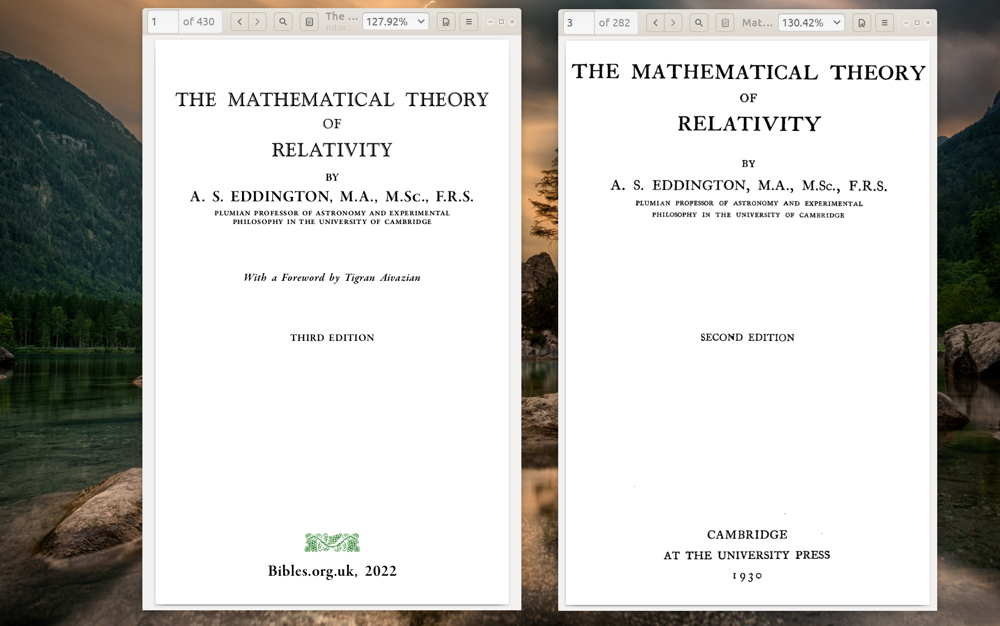

# Mathematical Theory of Relativity
A classic textbook on Relativity (both Special and General) by Sir Arthur Stanley Eddington, first published in 1923.

This book was originally based on the LaTeX source code which was produced by professor of mathematics at College
of the Holy Cross Andrew D. Hwang and made available under Public Domain at Project Gutenberg at:
[https://www.gutenberg.org/ebooks/59248](https://www.gutenberg.org/ebooks/59248)

I have edited and continue editing this work, comparing with the later (1924) edition,
as well as the Russian translation (1934), which included some improvements,
including those made for the German translation.

You can build the PDF file yourself or you can download it from [http://www.bibles.org.uk/books.html](http://www.bibles.org.uk/books.html)

